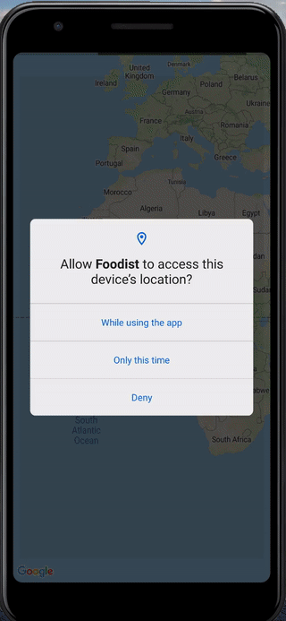

# _Foodist_ - Restaurant Finding App

# Introduction

Foodist is an android application for the "utmost foodie folks". Leveraging the Foursquare API, Foodist will show users
places to eat nearby.



# Getting Started

1. Install Android Studio or IntelliJ IDEA, if you don't already have it.
2. Download the repo.
3. Get a set of API keys from [Foursquare](https://foursquare.com/developers/apps) and
   [Google Maps](https://developers.google.com/maps/documentation/places/android-sdk/get-api-key)
4. Add a local.properties file in your project level directory containing the following:
    ```
    # Foursquare
    FOURSQUARE_CLIENT_ID=YOUR_TOKEN
    FOURSQUARE_CLIENT_SECRET=YOUR_TOKEN
    # Google Maps - make sure to enable the geolocation api as well 
    GOOGLE_MAPS_API_KEY=YOUR_TOKEN
    ```
5. Build and Run!

# Running Tests
 Right click the app directory and tap the option `Run 'All Tests'`

# Decisions

* Given the complexity of this application, I have chosen to call `ApiServices` directly. If this were a production
  application, I would add a layer of abstraction to leave the project with flexibility to switch the underlying request
  library.
* In a production application I would call the foursquare search api via a backend service. Currently, due to the project
  requirements I have hardcoded the foursquare restaurant category id but, this will make things painful in the long
  term if in the future we wanted to allow users to filter by category. In addition, api keys should not be stored on 
  the client.
* Initially the permissions were handled by a Fragment class that other features could inherit. After some though this
  leaks business logic into a view. In order to use `registerForActivityResult` we need access to either a `Fragment`
  or `Activity`. Given MVVM it makes the most sense to use this PermissionService in the ViewModel but, because the
  project uses Hilt you cannot inject something that is `@ActivityScoped` into a Service which is used by
  a `@ScopedViewModel`. Due to the limited scope of the project, I have decided to initialize the PermissionService when
  calling the viewModels first lifecycle method. If this were a production application we'd have other workarounds
  (using a ghost fragment, traversing the context tree, or keeping track of the current activity).
* Given more time I would have added a remove markers out of bounds markers feature but, that would require
  geo-bucketing (which is out of scope for the project) otherwise the cost of looking up what map markers are out of 
  bounds is quite expensive.
* The `LocationService` uses `FusedLocationProviderClient.lastLocation` because it is only necessary to get an approximate
  user's area the first time the app is launched. All subsequent app launches will show the map area that the
  user last viewed. If we wanted to always show the current area that the user is in, I would have used 
  `FusedLocationProviderClient.getLocationUpdates`.  